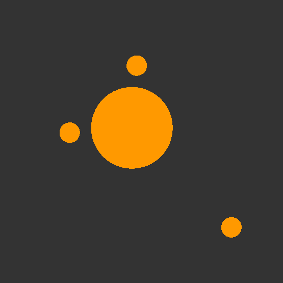
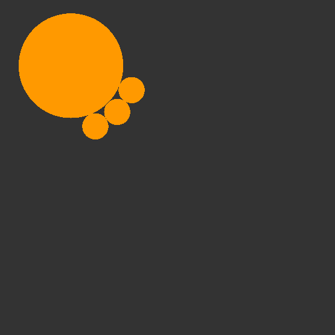

# Galaxy Simulation

A simplistic galaxy simulation: gravitational forces + collisions.

Code is heavily inspired from this [Piston-Tutorial](https://github.com/PistonDevelopers/Piston-Tutorials/tree/master/sudoku)

Collision was implemented using this [tutorial](https://gamedevelopment.tutsplus.com/tutorials/how-to-create-a-custom-2d-physics-engine-the-basics-and-impulse-resolution--gamedev-6331)

## Controls

create new `planets` by clicking on the window.

### Camera Controls

| keys         | action      |
|:-------------|------------:|
| arrows       | move camera |
| page up/down | zoom in/out |

## Config

see [config.json](res/config.json) (valid w.r to [json schema](res/config.schema))

## Crates

* [piston](https://github.com/PistonDevelopers/piston)
* [serde_json](https://github.com/serde-rs/json)